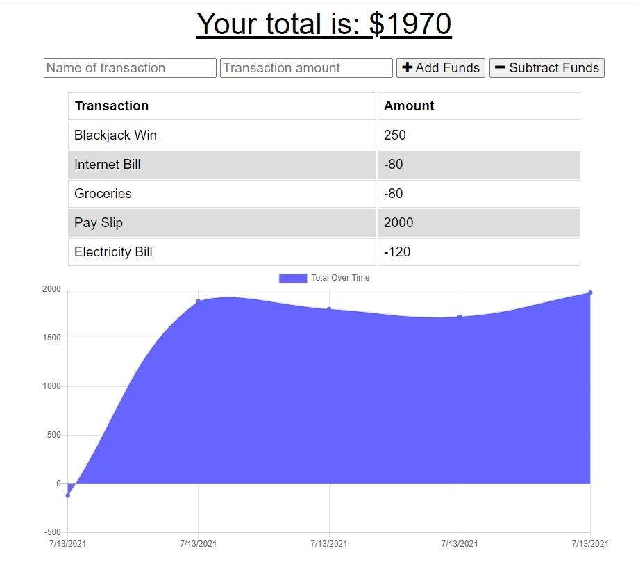

# Where'd My Money Go? 

  [](https://opensource.org/licenses/MIT)

  ## Table of Contents
  - [Description](#description)
  - [Installation](#installation)
  - [Usage Information](#usage-information)
  - [License](#license)
  - [Contribution Guidelines](#contribution-guidelines)
  - [Test Procedure](#test-procedure)
  - [Questions](#questions)
  - [Images](#images)

  ## Description
  A Budget Tracker application where users will be able to add expenses and deposits to the application, with or without an internet connection. When they are back online, the transactions that have been added should then populate the application. This is a Progressive Web App and it uses a Mongo Database with a Mongoose schema with routes handled with Express.

  Link to the [Budget Tracker](https://whered-my-money-go-bm.herokuapp.com/)

  ## Installation
  ```
  - npm i 
  - npm start
  ```

  ## Usage Information
  Use this application to track your expenses and deposits, whether you are online or offline.

  ## License
  MIT

  ## Contribution Guidelines
  Contribute freely

  ## Test Procedure
  n/a

  ## Questions
  If you have any questions, then feel free to contact me on the below:
  - Github: [bdjm94](https://github.com/bdjm94)
  - Email: [brendandjmoore@gmail.com](brendandjmoore@gmail.com)

  ## Images

| Main Page |
|------------|
  

| Budget Tracker in Use |
|------------|
  

